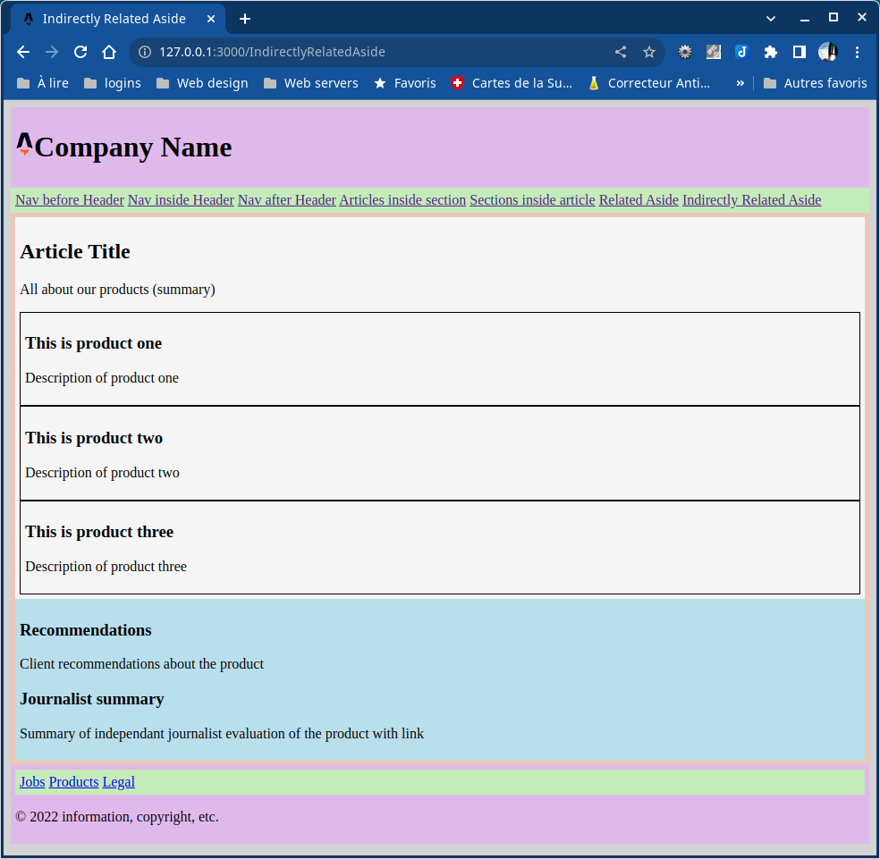

# Basic semantic HTML5 layouts

## Six basic layouts

- nav before header
- nav inside header
- nav after header
- articles inside section
- sections inside article
- related aside
- indirectly related aside

Deploy on Netlify at https://semantic-layouts.netlify.app/

## Upgrade from Astro to Eleventy

23 June 2023

1. Deleted everything from Astro & config
2. Installationof Eleventy
3. Layout & includes
4. Install stylesheet
5. Modify nav.html for automatic collections
6. Corrections
7. Problem with Netlify deploy (Build failed due to a user error: Build script returned non-zero exit code: 2)
Solution: go to Site settings -> Build & deploy -> Build settings -> Publish directory: change "dist" to "_site"